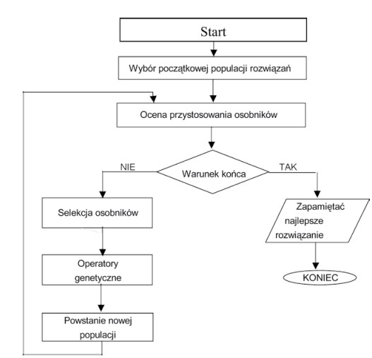

# Algorytm genetyczny

## Wprowadzenie

[Algorytmy genetyczne](https://en.wikipedia.org/wiki/Genetic_algorithm) (AG) to rodzaj heurystyki optymalizacyjnej opartej na mechanizmach [dziedziczenia genetycznego](https://en.wikipedia.org/wiki/Evolutionary_algorithm) i inspirowanej teorią ewolucji naturalnej Karola Darwina. Są one często stosowane do rozwiązywania problemów optymalizacyjnych, szczególnie w sytuacjach, gdzie tradycyjne metody matematyczne są niewystarczające. Algorytmy genetyczne opierają się na operatorach inspirowanych biologią, takich jak mutacja, krzyżowanie i selekcja.

### Podstawowe pojęcia związane z algorytmem genetycznym

- **Gen**, jak wiadomo z genetyki, jest podstawową materialną jednostką dziedziczenia, która jest związana z przekazywaniem poszczególnych cech dziedziczenia organizmu. Gen to pojedynczy element genotypu, w szczególności chromosomu. Gen może być również nazwany cechą, znakiem bądź detektorem.
- **Populacja** to zbiór potencjalnych osobników o określonej liczebności w danym pokoleniu algorytmu genetycznego
- **Selekcja** to proces wybierania osobników z populacji do reprodukcji na podstawie ich funkcji przystosowania. Osobniki o lepszej funkcji przystosowania mają większą szansę być wybrane, co imituje zjawisko naturalnej selekcji
- **Reprodukcja** to proces, w którym osobniki z wybranej populacji są używane do generowania potomstwa, które zastąpi starsze osobniki w kolejnym pokoleniu. W kontekście algorytmów genetycznych, proces reprodukcji obejmuje krzyżowanie i mutację.
- **Krzyżowanie** to operator genetyczny, w którym dwa rodziców są używane do stworzenia potomstwa poprzez wymianę fragmentów ich genotypów.
- **Mutacja** to losowa zmiana jednego lub więcej genów w genotypie osobnika. Jest to mechanizm wprowadzania różnorodności genetycznej w populacji, co pozwala na eksplorację nowych obszarów przestrzeni rozwiązań.
- **Genotyp**, czyli struktura jest zespołem chromosomów danego osobnika. W genetyce genotyp oznacza skład osobnika, w którym może występować więcej niż jeden chromosom. Komórki człowieka zawierają 46 chromosomów, natomiast w algorytmach genetycznych z reguły przyjmuje się, że genotyp składa się z jednego chromosomu, który jest traktowany jako osobnik populacji.
- **Chromosomy**, czyli łańcuchy stanowią uporządkowane ciągi genów. Długość chromosomów będzie uzależniona od warunków zadania. Warto podkreślić, że w organizmach żywych długość chromosomów może wynosić nawet do tysięcy genów.

### Kroki algorytmu genetycznego

1. **Inicjalizacja populacji**: na początku algorytmu genetycznego tworzona jest początkowa populacja, która składa się z pewnej liczby losowych osobników. Każdy osobnik w populacji reprezentuje potencjalne rozwiązanie problemu optymalizacyjnego i jest przedstawiany za pomocą genotypu.
2. **Selekcja**: Proces selekcji polega na wyborze osobników do reprodukcji w oparciu o ich funkcję przystosowania. Funkcja przystosowania ocenia, jak dobre jest dane rozwiązanie w kontekście rozwiązywanego problemu. Osobniki o lepszych wartościach funkcji przystosowania mają większą szansę być wybrane.
3. **Krzyżowanie**: Krzyżowanie jest operatorem genetycznym, który polega na kombinowaniu genotypów dwóch rodziców w celu stworzenia potomstwa. Punkt krzyżowania określa, gdzie następuje wymiana informacji genetycznej między rodzicami. Celem krzyżowania jest tworzenie potomstwa, które łączy korzystne cechy obu rodziców.
4. **Mutacja**: Mutacja to losowe wprowadzenie zmian genetycznych w genotypie niektórych osobników w populacji. Operacja ta ma na celu wprowadzenie nowej różnorodności genetycznej, co pomaga w eksploracji przestrzeni rozwiązań. Mutacja może modyfikować pojedyncze geny lub fragmenty genotypu.
5. **Ocena przystosowania**: Każdy osobnik w populacji jest oceniany pod kątem jego funkcji przystosowania. Funkcja przystosowania może być zdefiniowana w zależności od charakterystyki problemu optymalizacyjnego i mierzy, jak dobrze dany osobnik spełnia założone kryteria.
6. **Zastąpienie populacji**: Po ocenie przystosowania aktualizowana jest populacja. Osobniki o lepszych wartościach przystosowania zastępują te o niższych wartościach. Proces ten pomaga utrzymać lub zwiększyć poziom jakości rozwiązań w populacji.

Algorytm genetyczny powtarza te kroki przez określoną liczbę iteracji lub do momentu spełnienia pewnych warunków zakończenia. Warunki te mogą obejmować osiągnięcie określonej wartości funkcji przystosowania, przekroczenie maksymalnej liczby generacji, czy innych kryteriów zakończenia.



### Zastosowania

Algorytmy genetyczne mogą być użyte do rozwiązywania problemów, w których inne metody są nieskuteczne i mało efektowne. Często są to problemy nieliniowe, nieciągłe, źle uwarunkowane lub trudne do matematycznego sformułowania. Algorytmy genetyczne stosuje się jako doskonałe narzędzie do poprawienia efektywności innych metod optymalizacji poprzez wskazanie dobrych punktów startowych dla tych metod. Dzięki swojej wydajności i prostocie implementacji AG znalazły szerokie zastosowanie w rozwiązywaniu problemów takich jak: szeregowanie zadań, konstrukcja strategii inwestycyjnych, modelowanie finansowe, optymalizacja funkcji, podejmowanie decyzji oraz minimalizacja kosztów czy harmonogramowanie pracy itp. W zarządzaniu produkcją, algorytmy genetyczne zastosowano do znalezienia optymalnych wartości wielu parametrów, które reprezentują wagi pewnych kryteriów. Za pomocą algorytmu genetycznego prognozowano popyt na określone produkty w celu ustalenia wielkości produkcji w danym okresie planistycznym. W budowie maszyn wykorzystano algorytmy genetyczne do zaprojektowania odpowiednich cech sieci przemysłowej płynów. Często wykorzystuje się tę metodę do optymalizacji kształtu poprzez zminimalizowanie masy własnej z uwzględnieniem zachowania odpowiednich właściwości wytrzymałościowych. W niektórych pracach algorytmy użyto do optymalizacji parametrów technologicznych niektórych metod spajania materiałów czy optymalizacji kosztów całego procesu technologicznego. W eksploatacji maszyn algorytmy genetyczne znalazły zastosowanie do kontroli sposobu wytwarzania energii elektrycznej z zastosowaniem kilku jej źródeł jak również do rozwiązania odwrotnego zadania przepływu ciepła. Kolejnymi przykładami tej metody poszukiwań są optymalizacje sieci komputerowej, projektowanie laminatów czy poszukiwanie strategii rozwiązania pewnych problemów sterowania.

### Zalety

- **elastyczność** - AG mogą być dostosowywane do różnorodnych problemów optymalizacyjnych, zarówno w dziedzinie ciągłej, jak i dyskretnej
- **równoległość** - łatwość w równoległym przetwarzaniu, co pozwala na jednoczesną ewolucję wielu osobników, co przyspiesza proces optymalizacji
- **brak wymagań analitycznych** - AG nie wymagają znajomości analitycznej funkcji przystosowania czy pochodnych, co jest korzystne w przypadku problemów, dla których trudno jest uzyskać analityczne rozwiązania
- **skuteczność w przeszukiwaniu przestrzeni rozwiązań** - dzięki kombinacji operacji krzyżowania, mutacji i selekcji, AG mogą efektywnie przeszukiwać przestrzeń rozwiązań w poszukiwaniu optymalnych lub zbliżonych do optymalnych rozwiązań
- **znajdowanie rozwiązań globalnych** - zdolność do znajdowania rozwiązań globalnych, nawet w przypadku funkcji przystosowania o nieliniowym i skomplikowanym charakterze
- **szybkość** - mogą generować dobre rozwiązania przybliżone w krótkim czasie, co jest szczególnie korzystne w przypadku problemów optymalizacyjnych trudnych do rozwiązania dokładnie

### Ograniczenia

- **brak gwarancji optymalności** - AG nie zapewniają gwarancji znalezienia optymalnego rozwiązania, a jedynie dążą do znalezienia dobrego rozwiązania przybliżonego
- **wybór parametrów** - wybór odpowiednich parametrów, takich jak rozmiar populacji, prawdopodobieństwo krzyżowania i mutacji, może być trudny i czasochłonny
- **zależność** od struktury populacji początkowej - wyniki AG mogą być wrażliwe na strukturę początkowej populacji, co oznacza, że różne próby z tym samym problemem mogą prowadzić do różnych rezultatów
- **wrażliwość na kodowanie** - skuteczność AG może zależeć od wyboru odpowiedniego kodowania genotypu, co może być problematyczne w pewnych przypadkach
- **wymagania obliczeniowe** - AG mogą być czasochłonne, zwłaszcza przy rozwiązywaniu skomplikowanych problemów, co może wpływać na wydajność w niektórych zastosowaniach

## Implementacja algorytmu

### Biblioteki

- [Numpy](https://numpy.org/) >= 1.26.2

### Hiperparametry

- Hiperparametry Indywidualne:

  - `cel`: Funkcja celu, która jest minimalizowana przez algorytm genetyczny.
  - `granice`: Zakresy dla każdej zmiennej w funkcji celu. Określa dolne i górne ograniczenia wartości zmiennych.
  - `n_bits`: Liczba bitów używanych do reprezentacji każdej zmiennej w populacji.
  - `n_iter`: Ilość iteracji, czyli liczba pokoleń, przez które ewoluuje populacja.
  - `n_pop`: Wielkość populacji, czyli liczba osobników w każdym pokoleniu.
  - `r_cross`: Współczynnik krzyżowania, określający prawdopodobieństwo krzyżowania dwóch osobników.
  - `r_mut`: Współczynnik mutacji, określający prawdopodobieństwo mutacji bitu w osobniku.

    | --------------------------------------------------------------------------------------- |

- Funkcje pomocnicze:

  - `rozszyfruj`: Funkcja dekodująca ciąg bitów na liczby zgodnie z podanymi granicami.
  - `selekcja`: Funkcja implementująca selekcję turniejową do wyboru rodziców.
  - `krzyzowanie`: Funkcja krzyżowania dwóch rodziców w celu wygenerowania potomków.
  - `mutacja`: Operator mutacji, który odwraca bity z określonym prawdopodobieństwem.

### Kroki algorytmu

Pierwszym krokiem jest stworzenie populacji losowych ciągów bitowych. Możemy użyc wartości logicznych "True" i "False", wartości string '0' i '1' lub wartości int 0 i 1. W tym przykładzie, wykorzystamy wartości liczbowe.

Możemy wygenerować tablicę wartości całkowitych w zadanym zakresie za pomocą funkcji randint() a następnie określić zakres jako wartości zaczynąjące się od 0 a kończące na 2. Naszymi wynikami bedą zera i jedynki. Aby przedstawić przykład w jak najprostszy sposób, proponowane rozwiązanie zaprezentuję jako listę zamiast tablicy NumPy.

Poniżej prezentuję przykład utworzenia początkowej populacji losowej ciągu bitów. 'n_pop' jest hiperparametrem kontrolującym wielkość populacji, a 'n_bits' jest hiperparametrem definiującym liczbę bitów w pojedynczym rozwiązaniu.

```python
# Wczytywanie używanej biblioteki
from numpy.random import randint
from numpy.random import rand
```

```python
# Przykładowy kod tworzący populacje losowych ciągów bitowych
n_bits= 5
n_pop = 2
pop = [randint(0, 2, n_bits).tolist() for _ in range(n_pop)]
print(pop)
```

```
# Output
[[1, 0, 0, 0, 0], [0, 0, 1, 0, 1]]
```

Następnie możemy wyliczyć stałą liczbę iteracji algorytmu, w tym przypadku za tą stałą będzie odpowiedzialny hiperparametr o nazwie 'n_iter'

```python
# Do wyliczenia stałej liczby iteracji użyjemy pętli for (przykład)
 for gen in range(n_iter):
```

Pierwszym krokiem w jednej iteracji algorytmu jest ocena wszystkich potencjalnych rozwiązań.

Użyjemy funkcji o nazwie cel() jako ogólnej funkcji celu i wywołamy ją, aby uzyskać wynik wartości funkcji, który zminimalizujemy.

```python
#ocena wszystkich kandydatów w populacji
wyniki = [cel(c) for c in pop]
```

Następnie możemy wybrać rodziców, którzy zostaną wykorzystani do reprodukcji.
Procedurę selekcji można zaimplementować jako funkcję, która pobiera populację i zwraca jednego wybranego rodzica. Wartość k jest ustalona na 3 z domyślnym argumentem.

```python
# selekcja
def selekcja(pop, wyniki, k=3):
	# pierwszy losowy wybór
	selekcja_ix = randint(len(pop))
	for ix in randint(0, len(pop), k-1):
		# sprawdzanie czy wybrany został lepszy
		if wyniki[ix] < wyniki[selekcja_ix]:
			selekcja_ix = ix
	return pop[selekcja_ix]
```

Możemy wywołać tę funkcję jeden raz dla każdej pozycji w populacji, aby utworzyć listę rodziców.

```python
# wybór rodziców
wybrani = [selekcja(pop, wyniki) for _ in range(n_pop)]
```

Teraz możemy stworzyć kolejną generację.

Stworzenie kolejnej generacji najpierw wymaga funkcji do wykonania krzyżowania. Ta funkcja będzie uwzględniać dwoje rodziców i współczynnik krzyżowania. Współczynnik krzyżowania to hiperparametr określający, czy krzyżowanie jest wykonywane, czy nie, a jeśli nie, elementy nadrzędne są kopiowane do następnej generacji. Ten parametr to współczynnik prawdopodobieństwa i zazwyczaj ma dużą wartość bliską 1,0.

Poniższa funkcja krzyzowanie() implementuje krzyżowanie poprzez losowanie liczby z zakresu [0,1] w celu ustalenia, czy krzyżowanie jest wykonywane, a następnie wybiera prawidłowy punkt podziału, jeśli ma zostać przeprowadzone krzyżowanie.

```python
# krzyżowanie dwóch rodziców w celu wygenerowania dwojga potomków
def krzyzowanie(p1, p2, r_cross):
    # potomkowie domyślnie są kopią rodziców
	c1, c2 = p1.copy(), p2.copy()
	# sprawdzanie w celu rekombinacji
	if rand() < r_cross:
        # wybór punktu krzyżowania, który nie znajduje się na końcu ciągu
		pt = randint(1, len(p1)-2)
		# wykonanie krzyżowania
		c1 = p1[:pt] + p2[pt:]
		c2 = p2[:pt] + p1[pt:]
	return [c1, c2]
```

Potrzebujemy również funkcji do przeprowadzenia mutacji.

Ta procedura po prostu odwraca bity z niskim prawdopodobieństwem kontrolowanym przez hiperparametr „r_mut”.

```python
# operator mutacji
def mutacja(bitstring, r_mut):
	for i in range(len(bitstring)):
		# sprawdzanie w celu przeprowadzenie mutacji
		if rand() < r_mut:
			# odwrócenie bitu
			bitstring[i] = 1 - bitstring[i]
```

Aby utworzyć listę dzieci, które zostaną wykorzystane jako następne pokolenie, możemy zapętlić program przez listę rodziców, wywołując w razie potrzeby funkcje krzyżowania i mutacji

```python
# Kod w celu demonstracji- nie uruchamiać
# stworzenie następnej generacji
dzieci = list()
for i in range(0, n_pop, 2):
	# połączenie wybranych rodziców w pary
	p1, p2 = wybrani[i], wybrani[i+1]
	# krzyżowanie i mutacja
	for c in krzyzowanie(p1, p2, r_cross):
		# mutacja
		mutacja(c, r_mut)
		# zapisz dla następnej generacji
		dzieci.append(c)
```

Możemy połączyć to wszystko w funkcję o nazwie algorytm_genetyczny(), która pobiera nazwę funkcji celu oraz hiperparametry i zwraca najlepsze rozwiązanie znalezione podczas wyszukiwania.

```python
# algorytm genetyczny
def algorytm_genetyczny(cel, n_bits, n_iter, n_pop, r_krzyz, r_mut):
	# początkowa populacja losowego ciągu bitowego
	pop = [randint(0, 2, n_bits).tolist() for _ in range(n_pop)]
	# śledzenie najlepszego rozwiązania
	best, best_eval = 0, cel(pop[0])
	# wyliczanie pokoleń
	for gen in range(n_iter):
		# ocena wszystkich kandydatów w populacji
		wyniki = [cel(c) for c in pop]
		# sprawdzenie nowych najlepszych rozwiązań
		for i in range(n_pop):
			if wyniki[i] < best_eval:
				best, best_eval = pop[i], wyniki[i]
				print(">%d, nowe najlepsze rozwiązanie f(%s) = %.3f" % (gen,  pop[i], wyniki[i]))
		# wybór rodziców
		wybrani = [selekcja(pop, wyniki) for _ in range(n_pop)]
		# stworzenie nowej generacji
		dzieci = list()
		for i in range(0, n_pop, 2):
			# połączenie wybranych rodziców w pary
			p1, p2 = wybrani[i], wybrani[i+1]
			# krzyżowanie i mutacja
			for c in krzyzowanie(p1, p2, r_krzyz):
				mutacja(c, r_mut)
				# przechowywanie wyników dla następnego pokolenia
				dzieci.append(c)
		# zastąpienie populacji
		pop = dzieci
	return [best, best_eval]
```

### Przykład 1: One Max problem

W tej sekcji zastosujemy algorytm genetyczny do problemu optymalizacji opartego na ciągach binarnych.

Problem nazywa się OneMax i ocenia ciąg binarny na podstawie liczby jedynek w ciągu. Na przykład ciąg bitów o długości 20 bitów będzie miał wynik 20 dla ciągu składającego się wyłącznie z jedynek.

Biorąc pod uwagę, że zaimplementowaliśmy algorytm genetyczny w celu zminimalizowania funkcji celu, możemy dodać znak ujemny do tej oceny, tak że duże wartości dodatnie staną się dużymi wartościami ujemnymi.

Poniższa funkcja onemax() jako dane wejściowe pobiera ciąg bitów wartości całkowitych i zwraca ujemną sumę wartości.

```python
def onemax(x):
	return -sum(x)
```

Następnie możemy skonfigurować wyszukiwanie.

Wyszukiwanie będzie trwało 100 iteracji, a w naszych kandydujących rozwiązaniach użyjemy 20 bitów, co oznacza, że optymalna zgodność wyniesie -20,0.

Wielkość populacji wyniesie 100, a my zastosujemy współczynnik krzyżowania wynoszący 90 procent i współczynnik mutacji wynoszący 5 procent. Ta konfiguracja została wybrana metodą prób i błędów.

```python
# ilość iteracji
n_iter = 100
# ilość bitów
n_bits = 20
# wielkość populacji
n_pop = 100
# współczynnik krzyżowania
r_cross = 0.9
# współczynnik mutacji
r_mut = 1.0 / float(n_bits)
```

Następnie można wywołać wyszukiwanie i znaleźć najlepszy wynik.

```python
# przeprowadzenie wyszukiwania algorytmu genetycznego
best, score = algorytm_genetyczny(onemax, n_bits, n_iter, n_pop, r_cross, r_mut)
print('Znaleziono najlepsze rozwiązanie!')
print('f(%s) = %f' % (best, score))
```

Uruchomienie przykładu spowoduje wyświetlenie najlepszego wyniku znalezionego po drodze, a następnie ostatecznego najlepszego rozwiązania na końcu wyszukiwania, które będzie rozwiązaniem optymalnym.

```
# Output
>0, nowe najlepsze rozwiązanie f([1, 1, 0, 0, 1, 1, 0, 1, 0, 0, 1, 0, 1, 0, 1, 1, 1, 0, 0, 0]) = -10.000
>0, nowe najlepsze rozwiązanie f([0, 0, 1, 0, 1, 1, 0, 1, 0, 1, 1, 1, 0, 1, 1, 1, 0, 0, 1, 0]) = -11.000
>0, nowe najlepsze rozwiązanie f([1, 0, 1, 1, 0, 0, 0, 1, 1, 0, 0, 1, 1, 1, 1, 1, 1, 0, 0, 1]) = -12.000
>0, nowe najlepsze rozwiązanie f([0, 1, 1, 1, 0, 1, 1, 1, 1, 1, 0, 1, 0, 1, 1, 1, 1, 1, 1, 1]) = -16.000
>1, nowe najlepsze rozwiązanie f([1, 1, 1, 1, 0, 1, 1, 1, 1, 0, 0, 1, 1, 1, 1, 1, 1, 1, 1, 1]) = -17.000
>3, nowe najlepsze rozwiązanie f([1, 0, 1, 1, 1, 1, 1, 1, 1, 1, 1, 1, 0, 1, 1, 1, 1, 1, 1, 1]) = -18.000
>6, nowe najlepsze rozwiązanie f([1, 1, 1, 1, 1, 1, 1, 1, 1, 1, 1, 1, 0, 1, 1, 1, 1, 1, 1, 1]) = -19.000
>7, nowe najlepsze rozwiązanie f([1, 1, 1, 1, 1, 1, 1, 1, 1, 1, 1, 1, 1, 1, 1, 1, 1, 1, 1, 1]) = -20.000
Znaleziono najlepsze rozwiązanie!
f([1, 1, 1, 1, 1, 1, 1, 1, 1, 1, 1, 1, 1, 1, 1, 1, 1, 1, 1, 1]) = -20.000000
```

### Przykład 2: Optymalizacja funkcji ciągłej

Celem algorytmu genetycznego będzie znalezienie takich wartości zmiennych x, dla których funkcja celu przyjmuje możliwie najniższą wartość, co odpowiada minimalizacji tej funkcji. Funkcja celu ma wartosci optymalne przy f(0, 0) = 0,0.

```python
# funkcja celu
def cel(x):
	return x[0]**2.0 + x[1]**2.0
```

Chcąc przeprowadzić optymalizację za pomocą algorytmu genetycznego, najpierw musimy zdefiniować granice każdej zmiennej wejściowej. Ten fragment kodu definiuje zakresy dla zmiennych decyzyjnych, czyli przedziały, w których algorytm będzie przeszukiwał wartości zmiennych. W tym konkretnym przypadku granice są ustawione dla dwóch zmiennych decyzyjnych, z zakresem od -5 do 5.

```python
# zakres
granice = [[-5.0, 5.0], [-5.0, 5.0]]
```

Przyjmiemy n_bits jako liczbę bitów na jedną zmienną wejściową do funkcji celu i ustawimy ją na 16 bitów. Zwiększenie liczby bitów może poprawić zdolność algorytmu genetycznego do dokładniejszego przeszukiwania przestrzeni poszukiwań, ale może też zwiększyć złożoność obliczeniową.

```python
# liczba bitów na zmienną
n_bits = 16
```

Oznacza to, że nasz rzeczywisty ciąg bitów będzie miał (16 \* 2) = 32 bity, biorąc pod uwagę dwie zmienne wejściowe.

Musimy odpowiednio zaktualizować nasz współczynnik mutacji, czyli prawdopodobieństwo, że pojedynczy bit w genotypie zostanie odwrócony (zmutowany).

```python
# współczynnik mutacji
r_mut = 1.0 / (float(n_bits) * len(granice))
```

Następnie musimy się upewnić, że początkowa populacja tworzy losowe ciągi bitów, które są wystarczająco duże. Ta początkowa populacja genotypów jest wykorzystywana jako punkt wyjścia dla algorytmu genetycznego. W miarę kolejnych iteracji algorytmu, genotypy w populacji będą ewoluować poprzez operacje selekcji, krzyżowania i mutacji w kierunku lepszych rozwiązań.

```python
# początkowa populacja losowego ciągu bitowego
pop = [randint(0, 2, n_bits*len(granice)).tolist() for _ in range(n_pop)]
print(pop)
```

```
# Output
[[0, 1, 1, 1, 0, 0, 0, 1, 1, 0, 1, 1, 0, 1, 0, 0, 1, 0, 1, 1, 1, 0, 1, 1, 1, 0, 0, 0, 1, 1, 1, 0], [0, 1, 1, 1, 0, 0, 0, 0, 0, 0, 1, 1, 0, 0, 1, 0, 1, 0, 1, 1, 0, 0, 0, 0, 1, 0, 1, 1, 0, 0, 1, 0], [0, 1, 0, 0, 1, 0, 1, 1, 0, 1, 0, 1, 0, 0, 0, 1, 1, 0, 1, 0, 1, 0, 0, 1, 1, 1, 1, 1, 1, 0, 1, 0], [1, 0, 0, 0, 0, 1, 1, 0, 0, 1, 0, 1, 1, 0, 0, 1, 0, 0, 0, 0, 1, 1, 0, 0, 1, 1, 0, 0, 1, 1, 0, 0], [1, 0, 1, 0, 0, 1, 1, 0, 1, 0, 0, 0, 0, 1, 0, 0, 1, 0, 1, 1, 0, 1, 1, 0, 1, 1, 0, 1, 1, 0, 0, 0], [1, 1, 1, 1, 1, 1, 1, 0, 0, 1, 1, 0, 0, 1, 0, 0, 1, 0, 0, 0, 0, 0, 1, 0, 0, 0, 0, 0, 0, 0, 1, 0], [1, 1, 0, 1, 1, 1, 0, 0, 1, 0, 0, 1, 1, 0, 0, 0, 0, 0, 1, 0, 1, 1, 1, 1, 0, 1, 1, 0, 1, 0, 1, 1], [0, 0, 0, 0, 1, 1, 0, 1, 0, 0, 0, 1, 0, 1, 1, 1, 1, 1, 1, 1, 0, 1, 1, 0, 0, 1, 1, 1, 1, 1, 0, 0], [0, 1, 0, 0, 1, 1, 1, 1, 1, 0, 1, 1, 0, 1, 1, 0, 1, 0, 1, 1, 0, 0, 1, 1, 1, 1, 1, 0, 0, 0, 0, 0], [0, 1, 1, 1, 0, 0, 1, 0, 1, 1, 1, 1, 0, 1, 1, 0, 1, 0, 0, 1, 1, 1, 0, 1, 1, 1, 1, 1, 1, 0, 0, 0], [1, 1, 0, 1, 1, 0, 1, 0, 1, 0, 0, 0, 1, 0, 1, 0, 0, 0, 1, 1, 1, 1, 0, 1, 1, 0, 0, 0, 0, 1, 1, 0], [1, 1, 0, 0, 0, 0, 1, 0, 0, 0, 1, 1, 1, 1, 1, 1, 0, 0, 1, 1, 0, 0, 1, 0, 1, 0, 1, 1, 1, 1, 1, 0], [0, 1, 1, 1, 1, 1, 1, 0, 1, 1, 0, 1, 0, 1, 1, 0, 0, 1, 1, 0, 1, 1, 1, 0, 0, 1, 0, 0, 1, 1, 1, 0], [1, 0, 0, 1, 0, 1, 1, 1, 0, 0, 0, 1, 0, 1, 1, 1, 1, 1, 0, 0, 0, 1, 0, 1, 0, 0, 0, 1, 0, 0, 1, 0], [1, 0, 0, 0, 1, 1, 1, 0, 0, 0, 1, 1, 1, 1, 1, 0, 1, 1, 1, 0, 0, 0, 0, 0, 0, 1, 0, 1, 0, 1, 1, 0], [1, 1, 1, 1, 1, 0, 1, 0, 0, 1, 0, 1, 0, 1, 1, 0, 1, 0, 0, 0, 0, 0, 0, 0, 1, 0, 0, 0, 1, 1, 1, 0], [1, 1, 0, 1, 1, 1, 0, 1, 1, 1, 0, 1, 0, 0, 0, 1, 0, 0, 1, 0, 0, 0, 1, 1, 0, 0, 0, 0, 0, 0, 0, 0], [0, 0, 1, 1, 1, 0, 0, 1, 0, 1, 1, 1, 1, 1, 0, 0, 0, 1, 0, 1, 1, 1, 1, 0, 1, 1, 0, 0, 0, 0, 1, 1], [0, 0, 1, 0, 1, 1, 0, 0, 1, 1, 1, 0, 0, 0, 0, 0, 1, 1, 1, 1, 1, 1, 1, 1, 1, 1, 1, 1, 0, 1, 0, 0], [0, 1, 0, 1, 1, 1, 1, 0, 1, 0, 0, 1, 0, 0, 1, 0, 1, 0, 0, 1, 1, 1, 1, 0, 1, 0, 1, 1, 1, 1, 0, 1], [0, 0, 1, 0, 1, 1, 0, 0, 0, 1, 0, 1, 0, 1, 0, 0, 0, 0, 1, 1, 0, 0, 1, 0, 0, 1, 0, 0, 1, 1, 1, 1], [0, 1, 0, 1, 0, 1, 1, 1, 0, 1, 0, 1, 1, 0, 1, 0, 1, 1, 0, 0, 0, 0, 0, 0, 0, 1, 0, 0, 0, 1, 0, 0], [0, 0, 1, 0, 1, 1, 1, 1, 0, 1, 1, 0, 1, 0, 1, 0, 1, 0, 0, 1, 1, 0, 1, 1, 0, 0, 1, 1, 1, 1, 0, 1], [1, 1, 1, 1, 0, 1, 1, 0, 1, 1, 1, 0, 0, 1, 1, 0, 0, 0, 0, 1, 0, 1, 1, 1, 1, 0, 1, 0, 0, 1, 0, 0], [1, 0, 0, 0, 1, 0, 1, 0, 1, 0, 1, 0, 0, 1, 1, 1, 0, 1, 0, 0, 1, 1, 1, 1, 0, 0, 0, 0, 1, 0, 1, 1], [0, 0, 0, 0, 1, 1, 1, 1, 1, 1, 0, 1, 1, 1, 1, 0, 0, 1, 0, 1, 1, 0, 1, 1, 0, 0, 1, 1, 0, 1, 0, 1], [0, 0, 0, 0, 0, 1, 0, 1, 0, 0, 1, 0, 0, 1, 0, 1, 0, 0, 1, 0, 1, 0, 0, 1, 0, 0, 1, 1, 0, 1, 0, 1], [0, 0, 1, 0, 0, 1, 1, 0, 1, 0, 0, 0, 0, 1, 0, 0, 1, 0, 0, 1, 0, 0, 1, 0, 0, 1, 1, 0, 0, 0, 0, 1], [1, 0, 1, 0, 0, 1, 1, 1, 0, 0, 1, 1, 1, 1, 0, 0, 0, 1, 0, 1, 1, 1, 1, 1, 0, 1, 1, 1, 0, 1, 0, 0], [0, 1, 1, 1, 1, 0, 1, 0, 1, 1, 0, 1, 1, 0, 0, 1, 0, 0, 0, 0, 0, 1, 0, 0, 0, 0, 0, 1, 1, 1, 0, 0], [1, 0, 0, 0, 0, 1, 1, 1, 1, 0, 0, 1, 0, 0, 0, 1, 0, 0, 1, 0, 1, 1, 1, 0, 1, 1, 0, 0, 1, 0, 0, 0], [0, 0, 0, 0, 1, 0, 0, 0, 0, 1, 1, 0, 0, 0, 1, 0, 1, 1, 1, 1, 1, 1, 0, 1, 1, 0, 0, 0, 0, 0, 1, 0], [0, 1, 0, 0, 1, 0, 1, 1, 0, 0, 0, 0, 1, 0, 0, 0, 1, 1, 0, 1, 0, 0, 1, 0, 1, 1, 1, 0, 0, 0, 0, 1], [1, 0, 1, 0, 1, 0, 0, 1, 0, 0, 0, 1, 1, 0, 0, 1, 1, 1, 0, 0, 0, 1, 1, 1, 1, 0, 0, 0, 1, 1, 1, 1], [0, 1, 1, 0, 0, 1, 1, 0, 0, 1, 0, 1, 1, 1, 1, 1, 1, 1, 1, 0, 0, 0, 0, 0, 1, 0, 1, 1, 0, 1, 1, 0], [1, 1, 0, 1, 1, 0, 1, 0, 1, 0, 1, 1, 0, 0, 1, 0, 1, 0, 1, 1, 0, 0, 0, 1, 0, 1, 1, 0, 0, 0, 1, 1], [1, 1, 1, 1, 1, 0, 0, 0, 1, 1, 0, 0, 1, 0, 0, 0, 0, 0, 1, 0, 0, 0, 1, 0, 0, 0, 1, 1, 1, 1, 1, 1], [0, 0, 0, 0, 1, 0, 0, 1, 0, 1, 0, 1, 0, 0, 1, 1, 1, 0, 1, 0, 0, 0, 1, 1, 1, 1, 0, 0, 0, 0, 1, 1], [1, 0, 1, 1, 1, 1, 1, 0, 1, 0, 1, 1, 1, 1, 0, 1, 1, 0, 1, 0, 1, 1, 1, 0, 0, 0, 0, 0, 1, 0, 1, 0], [0, 1, 1, 1, 0, 1, 1, 0, 0, 0, 1, 0, 0, 0, 0, 0, 1, 0, 1, 1, 1, 0, 1, 0, 0, 1, 1, 0, 1, 1, 0, 0], [0, 0, 0, 1, 0, 1, 0, 1, 0, 0, 1, 1, 0, 1, 1, 1, 1, 1, 0, 1, 1, 1, 0, 1, 1, 1, 0, 0, 0, 1, 1, 0], [0, 1, 0, 0, 1, 1, 0, 1, 0, 0, 0, 0, 0, 0, 0, 1, 1, 1, 0, 1, 0, 1, 0, 1, 1, 1, 0, 1, 1, 0, 0, 1], [0, 1, 1, 1, 0, 0, 0, 0, 1, 0, 0, 0, 0, 1, 0, 1, 1, 1, 1, 0, 0, 0, 0, 1, 0, 0, 0, 1, 1, 0, 1, 1], [0, 1, 1, 0, 1, 1, 0, 1, 1, 1, 0, 1, 1, 1, 1, 1, 0, 1, 1, 0, 1, 1, 0, 1, 1, 1, 1, 0, 1, 0, 0, 0], [1, 1, 0, 1, 0, 1, 1, 1, 0, 1, 0, 0, 1, 0, 0, 0, 1, 0, 1, 1, 1, 0, 0, 0, 0, 1, 0, 0, 1, 0, 1, 1], [1, 0, 1, 1, 1, 1, 1, 1, 0, 1, 0, 1, 0, 1, 0, 0, 1, 1, 1, 0, 1, 1, 0, 0, 1, 0, 1, 1, 0, 0, 1, 1], [1, 0, 1, 1, 0, 1, 1, 0, 1, 1, 1, 0, 1, 0, 1, 0, 0, 0, 0, 0, 0, 1, 0, 1, 0, 0, 1, 1, 1, 1, 0, 0], [0, 1, 0, 0, 1, 1, 1, 0, 1, 1, 0, 1, 0, 1, 1, 0, 1, 0, 1, 0, 1, 0, 1, 1, 1, 0, 0, 0, 0, 0, 0, 1], [0, 1, 1, 0, 0, 0, 0, 0, 0, 0, 0, 1, 1, 0, 1, 0, 0, 1, 1, 1, 0, 0, 0, 0, 0, 1, 0, 0, 1, 0, 1, 0], [1, 1, 1, 0, 0, 0, 0, 1, 0, 0, 1, 0, 1, 1, 0, 0, 1, 0, 0, 0, 1, 0, 0, 1, 1, 0, 0, 0, 0, 1, 1, 1], [0, 1, 0, 1, 1, 1, 1, 1, 0, 1, 0, 0, 0, 1, 1, 1, 0, 1, 1, 0, 1, 1, 1, 0, 0, 1, 0, 1, 1, 0, 0, 1], [1, 0, 1, 0, 1, 0, 1, 1, 0, 0, 0, 1, 1, 0, 0, 1, 0, 0, 0, 0, 1, 1, 0, 1, 0, 0, 1, 1, 0, 1, 1, 0], [1, 1, 1, 0, 1, 1, 1, 0, 0, 1, 1, 0, 0, 1, 0, 1, 0, 1, 1, 1, 0, 1, 1, 1, 0, 0, 1, 0, 0, 0, 1, 1], [0, 0, 0, 0, 0, 0, 0, 1, 0, 1, 0, 1, 1, 1, 0, 1, 0, 1, 0, 0, 1, 0, 1, 1, 1, 0, 1, 1, 1, 0, 0, 1], [1, 0, 1, 0, 0, 0, 0, 1, 1, 1, 1, 1, 1, 0, 0, 1, 1, 1, 0, 0, 0, 0, 0, 0, 1, 1, 1, 1, 1, 1, 1, 1], [0, 0, 0, 1, 1, 0, 1, 1, 0, 1, 1, 1, 0, 0, 1, 1, 1, 1, 1, 1, 0, 1, 0, 0, 1, 1, 1, 0, 0, 0, 0, 1], [1, 1, 1, 0, 0, 0, 1, 1, 0, 0, 0, 1, 0, 1, 1, 1, 1, 0, 0, 0, 0, 0, 1, 0, 0, 1, 1, 1, 1, 0, 1, 0], [0, 1, 1, 1, 1, 1, 0, 1, 1, 1, 0, 1, 1, 0, 1, 1, 1, 0, 0, 1, 0, 0, 0, 1, 1, 0, 0, 1, 0, 1, 1, 1], [0, 0, 1, 0, 0, 1, 1, 1, 1, 0, 1, 0, 0, 1, 1, 1, 1, 1, 0, 0, 1, 0, 1, 1, 1, 0, 0, 0, 1, 0, 0, 1], [1, 1, 0, 0, 0, 0, 0, 1, 1, 0, 0, 0, 0, 1, 1, 1, 0, 0, 0, 0, 0, 0, 0, 0, 1, 1, 1, 0, 1, 1, 1, 0], [0, 1, 0, 0, 0, 1, 0, 0, 1, 0, 0, 1, 0, 1, 0, 0, 0, 1, 0, 0, 0, 0, 0, 1, 0, 0, 0, 1, 0, 1, 0, 0], [1, 0, 1, 1, 0, 1, 1, 1, 1, 0, 0, 1, 0, 0, 1, 1, 1, 0, 0, 1, 1, 0, 1, 1, 0, 1, 0, 1, 0, 0, 0, 1], [1, 0, 0, 0, 1, 0, 1, 1, 1, 0, 1, 0, 0, 1, 0, 1, 1, 0, 0, 1, 1, 1, 1, 1, 1, 1, 1, 1, 0, 1, 1, 0], [1, 0, 1, 1, 0, 0, 0, 1, 0, 1, 0, 0, 1, 1, 1, 1, 0, 0, 0, 0, 1, 0, 1, 0, 1, 1, 1, 0, 1, 0, 1, 1], [1, 1, 0, 1, 1, 0, 1, 1, 1, 1, 1, 1, 0, 0, 0, 1, 0, 0, 0, 0, 1, 0, 1, 0, 0, 0, 0, 1, 1, 0, 1, 0], [0, 1, 0, 0, 1, 0, 0, 0, 1, 1, 1, 0, 0, 0, 1, 0, 1, 1, 1, 1, 0, 1, 1, 1, 1, 0, 0, 1, 1, 1, 0, 0], [0, 1, 1, 1, 0, 0, 1, 1, 0, 0, 0, 1, 0, 1, 0, 0, 0, 0, 1, 0, 0, 1, 1, 0, 0, 1, 0, 1, 1, 0, 1, 1], [1, 1, 1, 1, 0, 0, 0, 0, 0, 0, 0, 0, 1, 1, 0, 1, 1, 0, 0, 0, 1, 0, 0, 0, 1, 0, 1, 1, 1, 0, 1, 0], [0, 0, 1, 0, 0, 1, 1, 1, 1, 1, 0, 1, 0, 1, 0, 0, 0, 1, 0, 1, 0, 0, 1, 0, 0, 0, 1, 1, 1, 0, 0, 0], [0, 0, 1, 0, 1, 0, 0, 0, 1, 0, 0, 0, 0, 1, 0, 1, 0, 1, 0, 0, 0, 0, 0, 0, 0, 0, 1, 1, 0, 0, 0, 1], [1, 0, 0, 0, 1, 1, 1, 0, 0, 0, 0, 0, 0, 1, 0, 0, 1, 1, 0, 1, 1, 0, 0, 0, 1, 1, 1, 1, 1, 1, 1, 0], [0, 0, 0, 0, 1, 1, 1, 1, 1, 0, 1, 1, 0, 1, 0, 0, 0, 0, 1, 0, 1, 0, 0, 1, 0, 0, 0, 0, 1, 1, 1, 0], [0, 0, 0, 1, 1, 1, 1, 1, 0, 1, 1, 0, 1, 1, 0, 1, 0, 1, 1, 0, 1, 0, 0, 1, 1, 0, 0, 1, 0, 1, 1, 0], [0, 1, 0, 0, 0, 1, 1, 0, 1, 0, 0, 0, 0, 1, 0, 0, 1, 0, 1, 1, 1, 0, 1, 1, 1, 0, 1, 1, 0, 1, 0, 1], [0, 0, 0, 1, 1, 1, 0, 1, 0, 0, 0, 1, 1, 1, 1, 1, 1, 1, 0, 0, 0, 0, 1, 1, 1, 1, 0, 0, 0, 1, 0, 0], [0, 1, 0, 1, 0, 0, 0, 0, 1, 0, 1, 0, 1, 1, 0, 0, 1, 1, 0, 1, 0, 1, 0, 1, 1, 0, 0, 0, 1, 1, 1, 1], [0, 0, 0, 0, 1, 0, 1, 1, 0, 1, 1, 0, 1, 1, 1, 0, 0, 1, 0, 0, 0, 0, 0, 0, 0, 0, 1, 1, 1, 0, 1, 0], [0, 0, 1, 1, 1, 0, 1, 1, 1, 0, 0, 0, 1, 1, 1, 1, 1, 1, 1, 0, 0, 1, 1, 0, 0, 0, 1, 1, 1, 1, 0, 1], [0, 1, 0, 0, 1, 0, 1, 0, 0, 0, 0, 1, 0, 1, 1, 0, 0, 0, 0, 1, 1, 1, 0, 0, 0, 1, 0, 1, 0, 0, 1, 1], [1, 1, 0, 0, 1, 0, 0, 1, 0, 1, 1, 1, 0, 0, 0, 0, 0, 1, 0, 0, 1, 0, 1, 1, 1, 1, 1, 1, 1, 0, 1, 1], [0, 0, 1, 0, 0, 0, 1, 0, 0, 1, 0, 1, 1, 0, 0, 1, 1, 0, 1, 0, 0, 1, 1, 0, 0, 0, 0, 1, 1, 0, 1, 1], [0, 1, 1, 1, 1, 1, 0, 0, 1, 1, 1, 0, 1, 1, 0, 1, 1, 0, 1, 1, 0, 0, 1, 1, 0, 0, 0, 0, 1, 1, 0, 1], [1, 1, 0, 1, 0, 0, 0, 0, 1, 1, 1, 0, 0, 1, 0, 1, 0, 1, 1, 0, 1, 0, 0, 1, 1, 1, 0, 1, 1, 0, 0, 1], [1, 0, 1, 0, 1, 0, 0, 1, 1, 1, 1, 0, 0, 0, 0, 0, 0, 1, 1, 0, 0, 1, 1, 0, 1, 1, 1, 0, 1, 0, 0, 0], [1, 0, 1, 0, 0, 1, 0, 0, 1, 0, 1, 1, 0, 1, 0, 1, 1, 1, 1, 1, 0, 1, 0, 0, 1, 0, 0, 1, 1, 1, 0, 0], [1, 0, 1, 1, 1, 0, 1, 1, 1, 1, 0, 1, 1, 1, 0, 1, 1, 1, 1, 0, 0, 0, 0, 0, 0, 1, 0, 1, 1, 0, 0, 1], [0, 0, 0, 1, 1, 1, 0, 1, 0, 1, 0, 1, 0, 1, 0, 0, 1, 1, 1, 0, 1, 1, 1, 0, 0, 1, 1, 1, 0, 1, 0, 0], [1, 0, 0, 0, 0, 1, 0, 0, 0, 1, 0, 1, 1, 0, 0, 1, 0, 1, 0, 1, 0, 1, 0, 1, 0, 0, 1, 0, 1, 1, 1, 1], [1, 1, 1, 0, 0, 1, 1, 1, 0, 0, 1, 1, 1, 1, 1, 1, 1, 1, 0, 0, 1, 1, 1, 0, 0, 1, 0, 1, 0, 0, 0, 0], [1, 0, 0, 0, 1, 1, 1, 1, 0, 1, 1, 1, 1, 1, 0, 0, 1, 1, 0, 1, 1, 0, 1, 0, 0, 1, 1, 1, 0, 1, 0, 0], [1, 0, 0, 1, 1, 1, 0, 1, 0, 0, 1, 1, 0, 0, 1, 1, 0, 1, 1, 0, 1, 0, 0, 1, 0, 1, 1, 0, 1, 0, 1, 0], [0, 0, 0, 1, 0, 0, 1, 1, 1, 0, 0, 0, 0, 0, 0, 0, 1, 0, 1, 1, 1, 1, 1, 1, 0, 1, 1, 1, 1, 1, 1, 1], [0, 1, 1, 1, 0, 1, 0, 1, 0, 0, 0, 1, 1, 1, 0, 1, 1, 0, 0, 0, 1, 0, 1, 0, 1, 1, 0, 0, 0, 0, 1, 1], [1, 0, 1, 1, 0, 0, 1, 0, 0, 1, 1, 1, 1, 1, 0, 0, 0, 1, 0, 1, 0, 1, 0, 1, 0, 1, 1, 0, 0, 1, 0, 1], [1, 1, 1, 0, 0, 1, 0, 0, 0, 0, 1, 0, 0, 1, 0, 0, 1, 1, 1, 1, 1, 1, 1, 0, 0, 1, 1, 1, 1, 1, 0, 1], [1, 0, 1, 1, 1, 0, 0, 1, 1, 1, 1, 0, 1, 0, 1, 0, 0, 1, 0, 1, 1, 0, 0, 1, 1, 1, 1, 0, 0, 0, 0, 1], [0, 1, 0, 0, 1, 0, 0, 0, 0, 0, 0, 0, 1, 0, 1, 0, 1, 1, 1, 0, 0, 1, 1, 0, 1, 1, 1, 0, 1, 0, 1, 0], [1, 1, 1, 0, 1, 1, 0, 1, 1, 1, 1, 0, 1, 1, 0, 1, 0, 0, 1, 1, 0, 1, 1, 1, 0, 0, 0, 0, 1, 0, 1, 1], [1, 0, 1, 1, 0, 0, 1, 0, 0, 0, 1, 1, 1, 0, 1, 0, 1, 1, 0, 0, 1, 1, 0, 0, 1, 0, 1, 1, 0, 1, 0, 0], [0, 1, 1, 0, 0, 0, 0, 0, 1, 0, 1, 1, 0, 1, 1, 0, 0, 1, 0, 1, 0, 0, 1, 0, 0, 1, 0, 1, 0, 0, 0, 0]]
```

Na koniec musimy rozszyfrować ciągi bitów na liczby przed oceną każdego z nich za pomocą funkcji celu.

Możemy to osiągnąć, najpierw rozszyfrowując każdy podciąg do liczby całkowitej, a następnie skalując liczbę całkowitą do żądanego zakresu. Otrzymamy wektor wartości w zakresie, który można następnie dostarczyć do funkcji celu, by umożliwić jego ocenę.

Poniższa funkcja rozszyfruj() przyjmuje granice funkcji, liczbę bitów na zmienną i ciąg bitów jako dane wejściowe i zwraca listę rozszyfrowanych wartości rzeczywistych.

```python
# rozszyfruj ciąg bitów na liczby
def rozszyfruj(granice, n_bits, bitstring):
	rozszyfrowane = list()
	najwieksze = 2**n_bits
	for i in range(len(granice)):
		# wyodrębnij podciąg
		poczatek, koniec = i * n_bits, (i * n_bits)+n_bits
		podciag = bitstring[poczatek:koniec]
		# przekształć ciąg bitów na ciąg znaków
		znaki = ''.join([str(s) for s in podciag])
		# przekształć ciąg znaków na liczbę całkowitą
		calkowita = int(znaki, 2)
		# skaluj liczbę całkowitą do pożądanego zakresu
		wartosc = granice[i][0] + (calkowita/najwieksze) * (granice[i][1] - granice[i][0])
		# zapisz
		rozszyfrowane.append(wartosc)
	return rozszyfrowane
```

Możemy następnie wywołać to na początku pętli algorytmu w celu rozszyfrowania populacji, a następnie oceny każdego osobnika w populacji za pomocą funkcji celu.

```python
...
# rozszyfrowanie populacji
rozszyfrowane = [rozszyfruj(granice, n_bits, p) for p in pop]
# ocena wszystkich kandydatów w populacji
wyniki = [cel(d) for d in rozszyfrowane]
```

Łącząc to razem, pełny przykład algorytmu genetycznego do optymalizacji funkcji ciągłej znajduje się poniżej.

```python
# importowanie funkcji randint i rand z biblioteki numpy

from numpy.random import randint
from numpy.random import rand

# funkcja celu
def cel(x):
	return x[0]**2.0 + x[1]**2.0

# dekodowanie ciągu bitów na liczby
def rozszyfruj(granice, n_bits, bitstring):
	rozszyfrowane = list()
	najwieksze = 2**n_bits
	for i in range(len(granice)):
		# wyodrębnij podciąg
		poczatek, koniec = i * n_bits, (i * n_bits)+n_bits
		podciag = bitstring[poczatek:koniec]
		# przekształć ciąg bitów na ciąg znaków
		znaki = ''.join([str(s) for s in podciag])
		# przekształć ciąg znaków na liczbę całkowitą
		calkowita = int(znaki, 2)
		# skaluj liczbę całkowitą do pożądanego zakresu
		wartosc = granice[i][0] + (calkowita/najwieksze) * (granice[i][1] - granice[i][0])
		# zapisz
		rozszyfrowane.append(wartosc)
	return rozszyfrowane

# selekcja turniejowa
def selekcja(pop, wyniki, k=3):
	# pierwszy losowy wybór
	selekcja_ix = randint(len(pop))
	for ix in randint(0, len(pop), k-1):
		# sprawdź, czy lepsze
		if wyniki[ix] < wyniki[selekcja_ix]:
			selekcja_ix = ix
	return pop[selekcja_ix]

# krzyżowanie dwóch rodziców w celu wygenerowania dwojga potomków
def krzyzowanie(p1, p2, r_cross):
    # potomkowie domyślnie są kopią rodziców
	c1, c2 = p1.copy(), p2.copy()
	# sprawdzanie w celu rekombinacji
	if rand() < r_cross:
        # wybór punktu krzyżowania, który nie znajduje się na końcu ciągu
		pt = randint(1, len(p1)-2)
		# wykonanie krzyżowania
		c1 = p1[:pt] + p2[pt:]
		c2 = p2[:pt] + p1[pt:]
	return [c1, c2]

# operator mutacji
def mutacja(bitstring, r_mut):
	for i in range(len(bitstring)):
		# sprawdzanie w celu przeprowadzenie mutacji
		if rand() < r_mut:
			# odwrócenie bitu
			bitstring[i] = 1 - bitstring[i]

# algorytm genetyczny
def algorytm_genetyczny(cel, granice, n_bits, n_iter, n_pop, r_cross, r_mut):
	# początkowa populacja losowego ciągu bitowego
	pop = [randint(0, 2, n_bits*len(granice)).tolist() for _ in range(n_pop)]
	# śledzenie najlepszego rozwiązania
	best, best_eval = 0, cel(rozszyfruj(granice, n_bits, pop[0]))
	# wyliczanie pokoleń
	for gen in range(n_iter):
		# rozszyfrowanie populacji
		rozszyfrowane = [rozszyfruj(granice, n_bits, p) for p in pop]
		# ocena wszystkich kandydatów w populacji
		wyniki = [cel(d) for d in rozszyfrowane]
		# sprawdzenie nowych najlepszych rozwiązań
		for i in range(n_pop):
			if wyniki[i] < best_eval:
				best, best_eval = pop[i], wyniki[i]
				print(">%d, nowe najlepsze rozwiązanie f(%s) = %f" % (gen,  rozszyfrowane[i], wyniki[i]))
		# wybór rodziców
		wybrani = [selekcja(pop, wyniki) for _ in range(n_pop)]
		# stworzenie nowej generacji
		dzieci = list()
		for i in range(0, n_pop, 2):
			# połączenie wybranych rodziców w pary
			p1, p2 = wybrani[i], wybrani[i+1]
			# krzyżowanie i mutacja
			for c in krzyzowanie(p1, p2, r_cross):
				# mutacja
				mutacja(c, r_mut)
				# przechowywanie wyników dla następnego pokolenia
				dzieci.append(c)
		# zastąpienie populacji
		pop = dzieci
	return [best, best_eval]

# zakres
granice = [[-5.0, 5.0], [-5.0, 5.0]]
# ilość iteracji
n_iter = 100
# liczba bitów na zmienną
n_bits = 16
# wielkość populacji
n_pop = 100
# współczynnik krzyżowania
r_cross = 0.9
# współczynnik mutacji
r_mut = 1.0 / (float(n_bits) * len(granice))
# przeprowadzenie wyszukiwania algorytmu genetycznego
best, score = algorytm_genetyczny(cel, granice, n_bits, n_iter, n_pop, r_cross, r_mut)
print('Koniec!')
rozszyfrowane = rozszyfruj(granice, n_bits, best)
print('f(%s) = %f' % (rozszyfrowane, score))
```

```
# Output
>0, nowe najlepsze rozwiązanie f([0.980072021484375, 1.4208984375]) = 2.979494
>0, nowe najlepsze rozwiązanie f([-1.417694091796875, 0.11871337890625]) = 2.023949
>0, nowe najlepsze rozwiązanie f([-0.82244873046875, 0.608062744140625]) = 1.046162
>0, nowe najlepsze rozwiązanie f([-0.952911376953125, 0.14404296875]) = 0.928788
>0, nowe najlepsze rozwiązanie f([-0.338592529296875, 0.413970947265625]) = 0.286017
>1, nowe najlepsze rozwiązanie f([-0.338592529296875, 0.246429443359375]) = 0.175372
>2, nowe najlepsze rozwiązanie f([0.212249755859375, -0.225830078125]) = 0.096049
>3, nowe najlepsze rozwiązanie f([0.211944580078125, 0.14892578125]) = 0.067099
>3, nowe najlepsze rozwiązanie f([0.1348876953125, 0.11871337890625]) = 0.032288
>4, nowe najlepsze rozwiązanie f([0.075836181640625, 0.001068115234375]) = 0.005752
>6, nowe najlepsze rozwiązanie f([0.06103515625, -0.0439453125]) = 0.005656
>7, nowe najlepsze rozwiązanie f([0.06103515625, -0.0433349609375]) = 0.005603
>9, nowe najlepsze rozwiązanie f([0.0103759765625, 0.01953125]) = 0.000489
>10, nowe najlepsze rozwiązanie f([0.010833740234375, 0.003509521484375]) = 0.000130
>11, nowe najlepsze rozwiązanie f([0.009918212890625, 0.0]) = 0.000098
>12, nowe najlepsze rozwiązanie f([0.000152587890625, 0.0]) = 0.000000
>14, nowe najlepsze rozwiązanie f([0.0, 0.0]) = 0.000000
Koniec!
f([0.0, 0.0]) = 0.000000
```


## Źródła

- [Simple Genetic Algorithm From Scratch in Python](https://machinelearningmastery.com/simple-genetic-algorithm-from-scratch-in-python/)
- [Genetic Algorithms - Introduction](https://www.tutorialspoint.com/genetic_algorithms/genetic_algorithms_introduction.htm)
- [Zastosowanie algorytmu genetycznego do wyznaczania składu aminokwasowego białek](https://depot.ceon.pl/bitstream/handle/123456789/3287/licencjat_informatyka_2007.pdf)
- [Introduction to Genetic Algorithms — Including Example Code](https://towardsdatascience.com/introduction-to-genetic-algorithms-including-example-code-e396e98d8bf3)
- [Genetic algorithm on wikipedia](https://en.wikipedia.org/wiki/Genetic_algorithm)
